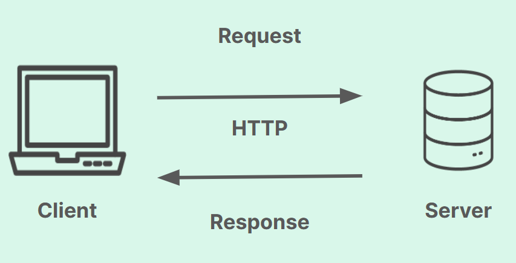

# Consumindo API



## HttpCliente
O HttCliente é uma classe do .NET que fornece uma API moderna e eficiente para fazer
requisições HTTP. Ela é a forma recomendada para fazer comunicação HTTP em aplicações.
Responsável por gerenciar conexões, cookies, headers, encoding, etc.

### Pra que serve?
- Integração com APIs REST: Consumir serviços web
- Download de conteúdo: Baixar arquivos, páginas web, dados
- Integração entre sistemas
- Consumo de microserviços

```
using (HttpClient cliente = new HttpClient()) 
{
    string response = await cliente.GetStringAsync("https://guilhermeonrails.github.io/api-csharp-songs/songs.json");
    Console.WriteLine(response);
}
```
A palavra reservada using garante que o objeto seja liberado da memória automaticamente

### GetStringAsync()
Esse método envia uma solicitação GET para a URI específicada e retorna o corpo da resposta
como uma cadeia de caracteres em uma operação assíncrona.

### using
É uma declaração muito útil que garante o descarte automático de recursos. Ele implementa o padrão
IDisposable, como funciona:
- Criação: O objeto é criado (new HttpClient())
- Uso: Você executa o código dentro do bloco
- Descarte automático: Quando o bloco termina (com sucesso ou erro), o método Dispose() é chamado automaticamente

## Exceção
Para garantir que não dê nenhum problema na requisição e a aplicação pare, vamos utilizar o
Try cath para capturar as exceções que eventualmente podem ser lançadas. Removi da minha API o "n" de "json"
para cair na exceção.

```
using (HttpClient cliente = new HttpClient()) 
{
    try
    {
        string response = await cliente.GetStringAsync("https://guilhermeonrails.github.io/api-csharp-songs/songs.jso");
        Console.WriteLine(response);
    }
    catch (Exception ex) 
    {
        Console.WriteLine($"Error: {ex.Message}");
    }
}
```

Retorno: Error: Response status code does not indicate success: 404 (Not Found).

Isso quer dizer que cada requisição que a gente faz, tem um código de resposta e nesse caso
foi o 404.

## Status Code
Os códigos de status de resposta HTTP indica se uma solicitação HTTP específica foi concluída
com êxito. As respostas são agrupadas em cinco classes:

- Respostas informativas: 100 - 199
- Respostas bem-sucedidas: 200 - 299
- Mensagens de redirecionamento: 300 - 399
- Respostas de erro do cliente: 400 - 499
- Respostas de erro do servidor: 500 - 599

## Resposta do meu JSON
```
{
        "artist": "Post Malone",
        "song": "rockstar (feat. 21 Savage)",
        "duration_ms": 218146,
        "explicit": "True",
        "year": "2018",
        "popularity": "83",
        "danceability": "0.585",
        "energy": "0.52",
        "key": 5,
        "loudness": "-6.136",
        "mode": "0",
        "speechiness": "0.0712",
        "acousticness": "0.124",
        "instrumentalness": "7.01e-05",
        "liveness": "0.131",
        "valence": "0.129",
        "tempo": "159.801",
        "genre": "hip hop"
    },
```

Vamos supor que eu queria usar apenas algumas propriedades 
desse json, como artist, song, genre, etc. Porém eu quero nas 
propriedades da minha classe e com nomes diferentes.

Usando JsonPropertyName eu consigo fazer isso:
```
internal class Musica
{
    [JsonPropertyName("song")]
    public string? Nome { get; set; }

    [JsonPropertyName("artist")]
    public string? Artista  { get; set; }

    [JsonPropertyName("duration_ms")]
    public int? Duracao { get; set; }

    [JsonPropertyName("genre")]
    public string? Genero { get; set; }
}
```

### JsonPropertyName
É um atributo(annotation) do namespace ***System.Text.Json.Serialization***
que mapeia a propriedade C# para um campo JSON com nome diferente. Ele serve
para deserializar JSON em objetos C#

Exemplo:
```
string json = "{\"song\": \"Bohemian Rhapsody\"}";
Musica musica = JsonSerializer.Deserialize<Musica>(json);
Console.WriteLine(musica.Nome); // Saída: Bohemian Rhapsody
```

## O que é um annotation?
É uma marcação declarativa que adiciona metadados ao código. Você "anota" classes,
métodos, propriedades, parâmetros, etc.., com informações extras que podem ser lidas
em tempo de compilação ou execução.

### Pra que serve?
Os atributos informam ao compilador, frameworks ou bibliotecas como tratar aquele
elemento.

Exemplos comuns:
```
// Serialização JSON - diz como mapear propriedades
[JsonPropertyName("song")]
public string Nome { get; set; }

// Validação - define regras de validação
[Required]
[MaxLength(100)]
public string Titulo { get; set; }

// Entity Framework - define chave primária
[Key]
public int Id { get; set; }

// ASP.NET - define rota de API
[HttpGet("api/musicas")]
public IActionResult GetMusicas() { }

// Marca método como obsoleto
[Obsolete("Use NovoMetodo() ao invés deste")]
public void MetodoAntigo() { }
```


# Referências
- Códigos de status de respostas HTTP: https://developer.mozilla.org/pt-BR/docs/Web/HTTP/Reference/Status